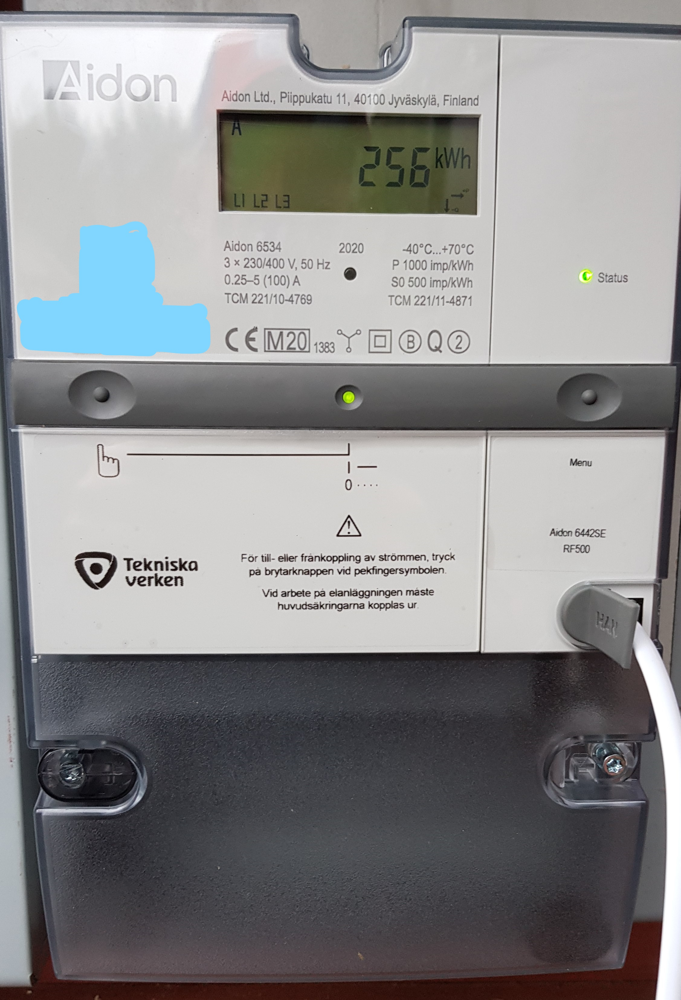
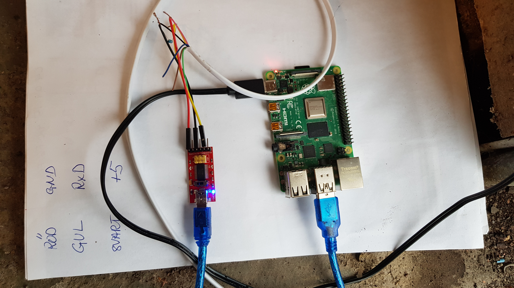

# Reading the Aidon 6534 power meter

## Table of Contents

* [Introduction](#introduction)
* [Things needed](#things-needed)
* [Connecting the Raspberry Pi to the Aidon 6534](#connecting-the-raspberrypi-to-the-aidon-6534)
* [Running the program](#running-the-program)
* [Home Assistant](#home-assistant)

## Introduction 

There it is! The brand new Aidon 6534 power meter. It has an `RJ12` connector. You can read 27 measurement values from it.

## Things needed
- A Raspberry Pi 4
- A [USB-serial cable](https://www.kjell.com/se/produkter/el-verktyg/arduino/moduler/luxorparts-usb-till-seriell-adapter-for-arduino-p88064)
- A 10 k resistor
- The program `ft232r_prog` for reprogramming the FTDI chip on the USB-serial cable.
- (An Intel NUC with Home Assistant)

## Connecting the RaspberryPi to the Aidon 6534
Connect the USB-serial cable to the Raspberry Pi. 
Then connect an RJ12 cable to the USB-serial cable like this:

| Aidon-RJ12       |  USB-serial cable  |
| ----             | ----           |
| 1 - (5V)         |                |
| 2 - RTS          | +5V            |
| 3 - GND          | GND            |
| 4 -              |                |
| 5 - Data         | RxD            |
| 6 - (GND)        |                |

Connect the two GNDs and +5V to RTS. The `Data` output is `open collector` so it needs a pull-up resistor. Connect a 10k resistor between +5V and RxD. Furthermore the `Data` ouput is inverted. Therefore the RxD input on the USB-serial cable needs to be inverted. Fortunately there is a program for this: `ft232r_prog`.
[Clone](https://github.com/eswierk/ft232r_prog) and `make`. Then give the command:
```bash
./ft232r_prog --help
```
and follow the instructions.

Aidon uses `115200,8N1` serial communication. 



## Running the program
Run the program by:
```bash
python3 aidon.py
```
If you use the command `python3 aidon.py -v` you get a printout. This is the printout from our meter:
```
Timestamp: 2020-10-06 17:57:10
Momentary active power+       =  720 W
Momentary active power-       =    0 W
Momentary reactive power+     =    0 var
Momentary reactive power-     =  149 var
Momentary current (L1)        = 2.2 A
Momentary current (L2)        = 0.7 A
Momentary current (L3)        = 0.4 A
Momentary voltage (L1)        = 233.9 V
Momentary voltage (L2)        = 234.7 V
Momentary voltage (L3)        = 234.8 V
Momentary active power+ (L1)  =  503 W
Momentary active power- (L1)  =    0 W
Momentary reactive power+ (L1)=    0 var
Momentary reactive power- (L1)=  175 var
Momentary active power+ (L2)  =  147 W
Momentary active power- (L2)  =    0 W
Momentary reactive power+ (L2)=   80 var
Momentary reactive power- (L2)=    0 var
Momentary active power+ (L3)  =   78 W
Momentary active power- (L3)  =    0 W
Momentary reactive power+ (L3)=    0 var
Momentary reactive power- (L3)=   56 var
Cumulative active energy+     = 261.4 kWh
Cumulative active energy-     =   0.0 kWh
Cumulative reactive energy+   =   1.8 kvarh
Cumulative reactive energy-   =  64.0 kvarh
```

If you run the program with the debug flag:
```bash
python3 aidon.py -d
```
you get this printout. It is the example in [Aidon](dokument/Aidon.pdf):
```bash
debug
Flags OK! first=last= 0x7e
Length OK! from header=received= 579
CRC OK! calculated=sent= 0x40be
Package length =  579
Nr of registers =   27

Flag:                                           7e 
Header:                                         a2 43 41 08 83 13 85 eb e6 e7 00 0f 40 00 00 00 00 01 1b 
Timestamp: 2019-12-16 08:59:40                  02 02 09 06 00 00 01 00 00 ff 09 0c 07 e3 0c 10 01 07 3b 28 ff 80 00 ff 
Momentary active power+       = 1122 W          02 03 09 06 01 00 01 07 00 ff 06 00 00 04 62 02 02 0f 00 16 1b 
Momentary active power-       =    0 W          02 03 09 06 01 00 02 07 00 ff 06 00 00 00 00 02 02 0f 00 16 1b 
Momentary reactive power+     = 1507 var        02 03 09 06 01 00 03 07 00 ff 06 00 00 05 e3 02 02 0f 00 16 1d 
Momentary reactive power-     =    0 var        02 03 09 06 01 00 04 07 00 ff 06 00 00 00 00 02 02 0f 00 16 1d 
Momentary current (L1)        = 0.0 A           02 03 09 06 01 00 1f 07 00 ff 10 00 00 02 02 0f ff 16 21 
Momentary current (L2)        = 7.5 A           02 03 09 06 01 00 33 07 00 ff 10 00 4b 02 02 0f ff 16 21 
Momentary current (L3)        = 0.0 A           02 03 09 06 01 00 47 07 00 ff 10 00 00 02 02 0f ff 16 21 
Momentary voltage (L1)        = 230.7 V         02 03 09 06 01 00 20 07 00 ff 12 09 03 02 02 0f ff 16 23 
Momentary voltage (L2)        = 249.9 V         02 03 09 06 01 00 34 07 00 ff 12 09 c3 02 02 0f ff 16 23 
Momentary voltage (L3)        = 230.8 V         02 03 09 06 01 00 48 07 00 ff 12 09 04 02 02 0f ff 16 23 
Momentary active power+ (L1)  =    0 W          02 03 09 06 01 00 15 07 00 ff 06 00 00 00 00 02 02 0f 00 16 1b 
Momentary active power- (L1)  =    0 W          02 03 09 06 01 00 16 07 00 ff 06 00 00 00 00 02 02 0f 00 16 1b 
Momentary reactive power+ (L1)=    0 var        02 03 09 06 01 00 17 07 00 ff 06 00 00 00 00 02 02 0f 00 16 1d 
Momentary reactive power- (L1)=    0 var        02 03 09 06 01 00 18 07 00 ff 06 00 00 00 00 02 02 0f 00 16 1d 
Momentary active power+ (L2)  = 1122 W          02 03 09 06 01 00 29 07 00 ff 06 00 00 04 62 02 02 0f 00 16 1b 
Momentary active power- (L2)  =    0 W          02 03 09 06 01 00 2a 07 00 ff 06 00 00 00 00 02 02 0f 00 16 1b 
Momentary reactive power+ (L2)= 1506 var        02 03 09 06 01 00 2b 07 00 ff 06 00 00 05 e2 02 02 0f 00 16 1d 
Momentary reactive power- (L2)=    0 var        02 03 09 06 01 00 2c 07 00 ff 06 00 00 00 00 02 02 0f 00 16 1d 
Momentary active power+ (L3)  =    0 W          02 03 09 06 01 00 3d 07 00 ff 06 00 00 00 00 02 02 0f 00 16 1b 
Momentary active power- (L3)  =    0 W          02 03 09 06 01 00 3e 07 00 ff 06 00 00 00 00 02 02 0f 00 16 1b 
Momentary reactive power+ (L3)=    0 var        02 03 09 06 01 00 3f 07 00 ff 06 00 00 00 00 02 02 0f 00 16 1d 
Momentary reactive power- (L3)=    0 var        02 03 09 06 01 00 40 07 00 ff 06 00 00 00 00 02 02 0f 00 16 1d 
Cumulative active energy+     = 10049.9 kWh     02 03 09 06 01 00 01 08 00 ff 06 00 99 59 86 02 02 0f 00 16 1e 
Cumulative active energy-     =   0.0 kWh       02 03 09 06 01 00 02 08 00 ff 06 00 00 00 08 02 02 0f 00 16 1e 
Cumulative reactive energy+   = 6614.3 kvarh    02 03 09 06 01 00 03 08 00 ff 06 00 64 ed 4b 02 02 0f 00 16 20 
Cumulative reactive energy-   =   0.0 kvarh     02 03 09 06 01 00 04 08 00 ff 06 00 00 00 05 02 02 0f 00 16 20 
CRC:                                            40be
Flag:                                           7e
```
As can clearly be seen this is binary communication not ASCII! The frame starts and ends with the same flag: `0x7e`.

## Home Assistant

The software publishes the following MQTT topics:

```
meter/activepowerimp
meter/activepowerexp
meter/reactivepowerimp
meter/reactivepowerexp
meter/current1
meter/current2
meter/current3
meter/voltage1
meter/voltage2
meter/voltage3
meter/activepower1imp
meter/activepower1exp
meter/reactivepower1imp
meter/reactivepower1exp
meter/activepower2imp
meter/activepower2exp
meter/reactivepower2imp
meter/reactivepower2exp
meter/activepower3imp
meter/activepower3exp
meter/reactivepower3imp
meter/reactivepower3exp
meter/activeenergyimp
meter/activeenergyexp
meter/reactiveenergyimp
meter/reactiveenergyexp
```

Put this in a `.yaml` file:
```yaml
mqtt:
  sensor:
    - name: "Active Power Imp"
      state_topic: "meter/activepowerimp"
      unit_of_measurement: "W"
#
# and so on
```
and this in another `.yaml`-file:
```yaml
title: Meter
icon: mdi:flash-auto
path: meter
cards:
  - type: vertical-stack
    cards:
      - type: gauge
        name: Effekt
        unit: 'W'
        entity: sensor.active_power_imp
        min: 0
        max: 11520
        severity:
          green: 0
          yellow: 2300
          red: 4600
# 
# and so on
```
and you will get this:


## Bibliography
### Data format
* [kode24](https://www.kode24.no/guider/smart-meter-part-1-getting-the-meter-data/71287300). An excellent breakdown of the data format.
* [Aidon RJ12 HAN Gränssnitt](dokument/Aidon.pdf)
* [The Green Book](https://www.dlms.com/files/Green_Book_Edition_9-Excerpt.pdf)
* [The Blue Book](https://www.dlms.com/files/Blue_Book_Edition_13-Excerpt.pdf)
### Home Assistant
* [The web site](https://www.home-assistant.io/)
* [Awesome Home Assistant](https://github.com/isabellaalstrom/home-assistant-config). I don't publish my Home Assistant installation. Have a look at this instead!
### Hardware
* [ft232r_prog](https://github.com/eswierk/ft232r_prog)

