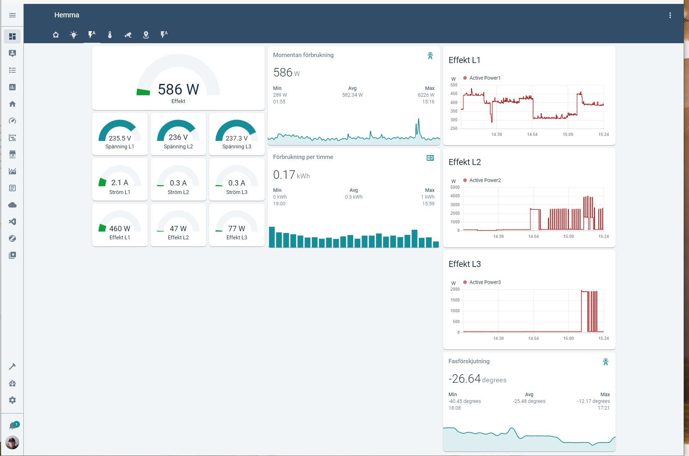

# Aidon 6534


## Software for reading of the Aidon 6534 meter. 
Run the program by:
```
python3 aidon3.py
```

## Things needed
- A Raspberry Pi 4
- A [USB-serial cable](https://www.kjell.com/se/produkter/el-verktyg/arduino/moduler/luxorparts-usb-till-seriell-adapter-for-arduino-p88064)
- A 10 k resistor
- The program `ft232r_prog` for reprogramming the FTDI chip on the USB-serial cable.

## Connecting the RaspberryPi to the  Aidon 6534
Connect the Raspberry Pi to a USB-serial cable. 
Then connect an RJ12 cable to the USB-serial cable:

| Aidon-RJ12       |  USB-serial cable  |
| ----             | ----           |
| 1 - 5V           |                |
| 2 - RTS          | 5V             |
| 3 - GND          | GND            |
| 4 -              |                |
| 5 - Data         | RxD            |
| 6 - GND          |                |

A 10k resistor is connected between 5V and RxD on the FTDI. The RxD input on the USB-serial cable is inverted with the program `ft232r_prog`.

## Data Sent

The software publishes the following MQTT topics:

```
meter/activepower
meter/activepower1
meter/activepower2
meter/activepower3
meter/voltage1
meter/voltage2
meter/voltage3
meter/current1
meter/current2
meter/current3
meter/activeenergy
```

## Home asssistant configuration
Put this in `.yaml` file:
```
sensor:
  - platform: mqtt
    state_topic: "meter/activepower"
    name: "Active Power"
    unit_of_measurement: "W"
#
# and so on
```





